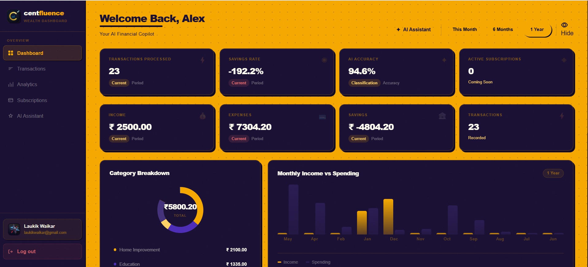
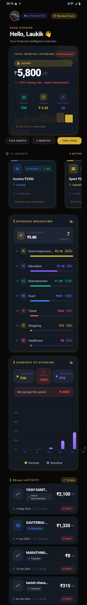
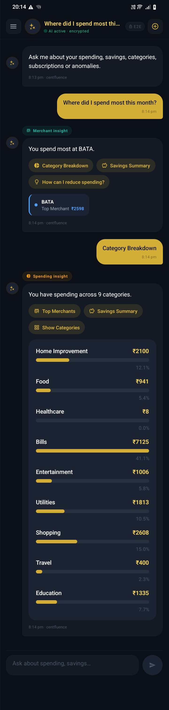
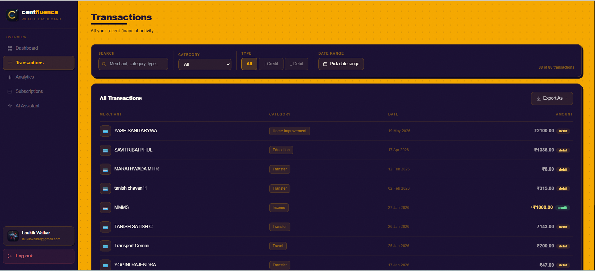
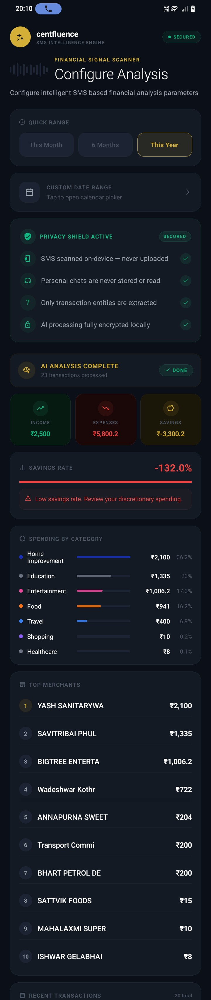
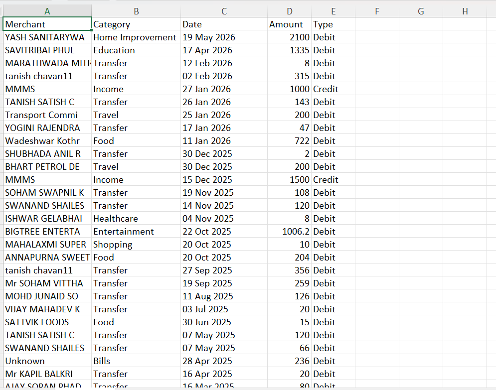
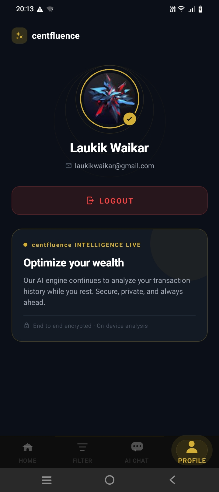
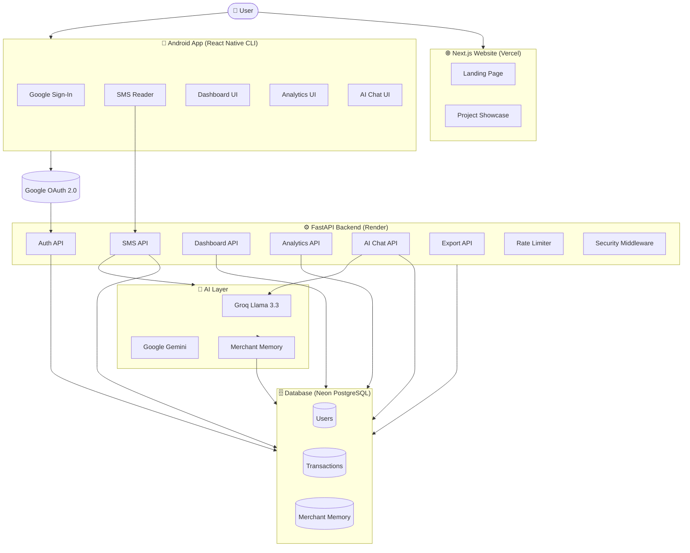

<div align="center">

# 💰 CentFluence

### AI-Powered Personal Finance Intelligence Platform

*Stop tracking expenses manually. Let AI read your bank SMS and do it for you.*


</div>

---

## 📋 Table of Contents

- [Live Demo](#-live-demo)
- [Screenshots](#-screenshots)
- [Demo Video](#-demo-video)
- [Problem Statement](#-problem-statement)
- [Features](#-features)
- [Project Flow](#-project-flow)
- [High-Level Architecture](#-high-level-architecture)
- [Folder Structure](#-folder-structure)
- [Tech Stack](#-tech-stack)
- [AI Pipeline](#-ai-pipeline)
- [Security Features](#-security-features)
- [Dashboard Features](#-dashboard-features)
- [API Documentation](#-api-documentation)
- [Installation & Setup](#-installation--setup)
- [Environment Variables](#-environment-variables)
- [Deployment](#-deployment)
- [Challenges Faced](#-challenges-faced)
- [Lessons Learned](#-lessons-learned)
- [Future Improvements](#-future-improvements)
- [What This Project Demonstrates](#-what-this-project-demonstrates)
- [Contributing](#-contributing)
- [License](#-license)
- [Author](#-author)

---

## 🌐 Live Demo

| Component | URL |
|-----------|-----|
| 🌍 Website | [centfluence.vercel.app](https://centfluence-frontend.vercel.app) |
| ⚙️ Backend API | [centfluence-api.onrender.com](https://centfluence-backend.onrender.com) |
| 📱 Android APK | Not publicly distributed — see [Demo Video](https://drive.google.com/file/d/1FsbMqtaUgaHRyhQf4GXgGETUT0OEIRNV/view?usp=drive_link) |

> **Note:** Due to Google Play Protect restrictions on SMS-reading applications, the Android APK is not publicly distributed. A full walkthrough video is provided below.

---

## 📸 Screenshots

| Screen | Preview |
|--------|---------|
| 🏠 Landing Page |  |
| 🔐 Google Login |  |
| 📊 Dashboard |  |
📊 Dashboard |  |
| 📈 Analytics |  |
| 🏪 Merchant Intelligence |  |
| 🤖 AI Chat Assistant |  |
| 🤖 AI Chat Assistant Mobile |  |
| 📋 Transaction History |  |
| 📱 SMS Analysis |  |
| 📤 Export |  |
| 👤 Profile |  |

---

## 🎬 Demo Video

> Because CentFluence reads banking SMS messages, it requires SMS permissions that trigger Google Play Protect warnings, preventing standard APK distribution. A full demonstration video is available instead.

📹 **[Watch Full Demo Video →]https://drive.google.com/file/d/1FsbMqtaUgaHRyhQf4GXgGETUT0OEIRNV/view?usp=drive_link**

The video covers: Google Login → SMS Permission → Transaction Parsing → Dashboard → Analytics → AI Chat → Export.

---

## 🎯 Problem Statement

Traditional expense tracking apps share one fundamental flaw: **they require you to manually add every expense**.

- Forgot to log a transaction? Your data is wrong.
- Too busy to open the app after every purchase? Your history is incomplete.
- Relying on memory for last month's spending? You're guessing.

**CentFluence solves this completely.**

Your bank already sends you an SMS every time money moves. CentFluence reads those messages (with your permission), understands them using AI, categorizes each merchant, stores structured records, and builds a live financial dashboard — automatically.

No manual entry. No guesswork. Just intelligence.

---

## ✨ Features

### 🔐 Authentication
- Google OAuth 2.0 Sign-In
- Secure JWT access and refresh tokens
- Protected routes with authentication middleware

### 📊 Dashboard
- Total income, expenses, and savings at a glance
- Category-wise expense breakdown
- Top merchants by spending
- Monthly trend charts
- Subscription detection
- Financial health scoring

### 🤖 AI Features
- Automatic merchant classification using Groq Llama 3.3
- Merchant memory to avoid redundant AI calls
- Conversational AI Financial Assistant
- Intent detection (finance-only queries enforced)
- Context-aware financial recommendations
- Smart spending insights

### 📈 Analytics
- Expense and income distribution
- Category-level spending trends
- Monthly comparison charts
- Savings analysis
- Subscription intelligence

### 📱 SMS Processing
- Automatic banking SMS reading (Android)
- Regex-based amount, merchant, date, and reference extraction
- Transaction type detection (debit/credit)
- Confidence scoring per transaction

### 📤 Exports
- Export transactions and analytics

### 🛡️ Security
- JWT + Refresh Token flow
- Google OAuth token verification
- Rate limiting on all endpoints
- Security headers
- CORS configuration
- Pydantic validation and input sanitization
- SQLAlchemy ORM (parameterized queries, no raw SQL)
- Environment-based secret management
- Centralized exception handling and logging

### 🌐 Responsive Website
- Public portfolio and project showcase
- Architecture diagrams, feature highlights, screenshots
- Demo video embed
- Hosted on Vercel

---

## 🔄 Project Flow

```
1. AUTHENTICATION
   User opens app → Taps "Sign in with Google"
   → Google OAuth issues Identity Token
   → Backend verifies token → Generates JWT Access + Refresh Tokens
   → Authenticated session begins

2. SMS PERMISSION
   App requests Android SMS READ permission
   → User grants permission
   → App reads all SMS from inbox

3. TRANSACTION PARSING
   For each SMS:
   → Regex detects banking keywords
   → Extracts: Amount, Merchant, Date, Reference, Transaction Type
   → Builds structured transaction object

4. AI MERCHANT CLASSIFICATION
   → Merchant name is normalized
   → Merchant memory (database) is checked
   → If known: category reused instantly
   → If unknown: Groq Llama 3.3 classifies the merchant
   → Category saved to merchant memory for future use

5. DATABASE STORAGE
   → Structured transaction stored in Neon PostgreSQL
   → Fields: amount, merchant, category, type, date, reference, user_id, confidence

6. DASHBOARD GENERATION
   → Backend aggregates: income, expenses, savings, top merchants, trends
   → REST API returns computed dashboard payload

7. ANALYTICS ENGINE
   → Generates: category distribution, monthly trends, subscription detection
   → Financial health metrics calculated

8. AI FINANCIAL ASSISTANT
   → User asks a finance question in natural language
   → Backend builds financial context from user's transaction data
   → Context + question sent to Groq Llama 3.3
   → AI generates personalized financial advice
   → Non-financial queries are rejected by intent detection

9. EXPORTS
   → User exports transaction history or analytics report
```

---

## 🏗️ High-Level Architecture



---

## 📁 Folder Structure

```
centfluence/
│
├── 🌐 website/                        # Next.js Portfolio Website
│   ├── app/
│   │   ├── page.tsx                   # Landing page
│   │   ├── layout.tsx
│   │   └── globals.css
│   ├── components/
│   │   ├── Hero.tsx
│   │   ├── Features.tsx
│   │   ├── Architecture.tsx
│   │   ├── Screenshots.tsx
│   │   └── TechStack.tsx
│   ├── public/
│   ├── tailwind.config.ts
│   └── next.config.ts
│
├── ⚙️ backend/                        # FastAPI Backend
│   ├── main.py                        # App entry point
│   ├── config.py                      # Environment config
│   ├── database.py                    # DB connection
│   ├── models/
│   │   ├── user.py
│   │   ├── transaction.py
│   │   └── merchant.py
│   ├── routers/
│   │   ├── auth.py
│   │   ├── sms.py
│   │   ├── dashboard.py
│   │   ├── analytics.py
│   │   ├── chat.py
│   │   ├── export.py
│   │   └── user.py
│   ├── services/
│   │   ├── auth_service.py
│   │   ├── sms_parser.py
│   │   ├── merchant_classifier.py
│   │   ├── dashboard_service.py
│   │   ├── analytics_service.py
│   │   └── ai_chat_service.py
│   ├── middleware/
│   │   ├── rate_limiter.py
│   │   └── security.py
│   ├── schemas/
│   └── requirements.txt
│
└── 📱 mobile/                         # React Native Android App
    ├── src/
    │   ├── screens/
    │   │   ├── AuthScreen.tsx
    │   │   ├── DashboardScreen.tsx
    │   │   ├── TransactionsScreen.tsx
    │   │   ├── AnalyticsScreen.tsx
    │   │   ├── ChatScreen.tsx
    │   │   ├── MerchantsScreen.tsx
    │   │   ├── ProfileScreen.tsx
    │   │   └── SettingsScreen.tsx
    │   ├── components/
    │   ├── navigation/
    │   ├── services/
    │   │   ├── api.ts
    │   │   ├── smsReader.ts
    │   │   └── auth.ts
    │   ├── hooks/
    │   └── utils/
    ├── android/
    ├── index.js
    └── package.json
```

---

## 🛠️ Tech Stack

| Layer | Technology |
|-------|-----------|
| **Mobile** | React Native CLI, TypeScript |
| **Navigation** | React Navigation |
| **Charts (Mobile)** | React Native Gifted Charts |
| **Storage (Mobile)** | AsyncStorage |
| **Networking** | Axios |
| **Icons** | React Native Vector Icons |
| **Website** | Next.js, React, TypeScript |
| **Styling** | Tailwind CSS |
| **Backend** | FastAPI, Python |
| **ORM** | SQLAlchemy |
| **Validation** | Pydantic |
| **Database** | PostgreSQL (Neon) |
| **AI Models** | Groq Llama 3.3, Google Gemini |
| **Authentication** | Google OAuth 2.0, JWT |
| **Website Hosting** | Vercel |
| **Backend Hosting** | Render |

---

## 🤖 AI Pipeline

```
📩 Raw Banking SMS
        ↓
🔍 Regex Extraction
   • Amount         (₹2,500 debited)
   • Merchant name  (Zomato, Amazon, SBI ATM)
   • Date & Time
   • Reference No.
   • Transaction Type (debit / credit)
        ↓
🧹 Merchant Name Normalization
        ↓
📦 Merchant Memory Lookup (PostgreSQL)
        ↓
  ┌─────────────────────────────┐
  │  Known Merchant?            │
  │  YES → Reuse saved category │
  │  NO  → Call Groq Llama 3.3  │
  └─────────────────────────────┘
        ↓
🏷️ AI Classification
   Categories: Food | Shopping | Travel | Healthcare |
   Bills | Entertainment | Education | Income | Transfer | Other
        ↓
💾 Save to Merchant Memory (for future reuse)
        ↓
🗃️ Store Transaction in PostgreSQL
        ↓
📊 Dashboard API  →  Analytics API  →  AI Insights
```

**Why Merchant Memory?** Every AI call costs latency and tokens. CentFluence remembers every merchant it has ever classified. Once "Zomato" is classified as `Food`, no future transaction from Zomato ever calls the AI again. This makes the pipeline faster and cost-efficient at scale.

---

## 🛡️ Security Features

| Feature | Why It Matters |
|---------|---------------|
| **JWT Access Tokens** | Short-lived tokens limit exposure if intercepted |
| **Refresh Tokens** | Enables seamless re-authentication without repeated logins |
| **Google OAuth Verification** | Backend verifies the Identity Token directly with Google — cannot be spoofed |
| **Protected Routes** | All sensitive endpoints require a valid JWT |
| **Rate Limiting** | Prevents brute force attacks and API abuse |
| **Security Headers** | Protects against XSS, clickjacking, and MIME sniffing |
| **CORS Configuration** | Only whitelisted origins can call the API |
| **Pydantic Validation** | All incoming data is type-checked and sanitized before processing |
| **SQLAlchemy ORM** | Parameterized queries eliminate SQL injection risk |
| **Environment Variables** | No secrets are hardcoded; all credentials are injected at runtime |
| **Centralized Exception Handling** | Errors are caught globally — no raw stack traces exposed to clients |
| **Logging** | All API activity is logged for audit and debugging |

---

## 📊 Dashboard Features

| KPI | Description |
|-----|-------------|
| 💵 Total Income | Sum of all credit transactions in period |
| 💸 Total Expenses | Sum of all debit transactions in period |
| 💰 Savings | Income minus Expenses |
| 🏷️ Category Breakdown | Pie/bar chart of spend by category |
| 🏪 Top Merchants | Ranked list of merchants by total spend |
| 📋 Recent Transactions | Latest 10–20 transactions with merchant and amount |
| 🔄 Subscriptions | Auto-detected recurring transactions |
| ❤️ Financial Health | Composite score based on savings rate, categories, and trends |
| 📅 Monthly Trends | Line chart of income vs expense over months |

---

## 📡 API Documentation

### Authentication

| Endpoint | Method | Auth | Description |
|----------|--------|------|-------------|
| `/auth/google` | POST | ❌ | Verify Google Identity Token, issue JWT |
| `/auth/refresh` | POST | ❌ | Exchange refresh token for new access token |
| `/auth/logout` | POST | ✅ JWT | Invalidate session |

### SMS & Transactions

| Endpoint | Method | Auth | Description |
|----------|--------|------|-------------|
| `/sms/process` | POST | ✅ JWT | Submit raw SMS list for parsing and storage |
| `/transactions` | GET | ✅ JWT | Paginated transaction history |
| `/transactions/{id}` | GET | ✅ JWT | Single transaction detail |

### Dashboard

| Endpoint | Method | Auth | Description |
|----------|--------|------|-------------|
| `/dashboard` | GET | ✅ JWT | Full dashboard payload (KPIs, charts, trends) |

### Analytics

| Endpoint | Method | Auth | Description |
|----------|--------|------|-------------|
| `/analytics/expenses` | GET | ✅ JWT | Category-wise expense distribution |
| `/analytics/trends` | GET | ✅ JWT | Monthly income vs expense trends |
| `/analytics/merchants` | GET | ✅ JWT | Merchant intelligence |
| `/analytics/subscriptions` | GET | ✅ JWT | Detected recurring transactions |

### AI Chat

| Endpoint | Method | Auth | Description |
|----------|--------|------|-------------|
| `/chat` | POST | ✅ JWT | Ask a financial question; returns AI response |

### Export & User

| Endpoint | Method | Auth | Description |
|----------|--------|------|-------------|
| `/export/transactions` | GET | ✅ JWT | Export user transactions |
| `/user/profile` | GET | ✅ JWT | Fetch authenticated user profile |
| `/health` | GET | ❌ | Backend health check |

---

## ⚙️ Installation & Setup

### Prerequisites

- Node.js 18+
- Python 3.10+
- Android Studio (for mobile)
- PostgreSQL (or Neon account)

### 1. Backend

```bash
cd backend
python -m venv venv
source venv/bin/activate        # Windows: venv\Scripts\activate
pip install -r requirements.txt

# Copy and fill in environment variables
cp .env.example .env

# Start the server
uvicorn main:app --reload
```

### 2. Website

```bash
cd website
npm install

# Copy and fill in environment variables
cp .env.local.example .env.local

npm run dev
```

### 3. Mobile App

```bash
cd mobile
npm install

# Start Metro bundler
npx react-native start

# Run on Android device/emulator (new terminal)
npx react-native run-android
```

> **Android Setup:** Ensure Android Studio is installed, `ANDROID_HOME` is set, and a device/emulator is connected.

---

## 🔐 Environment Variables

### Backend `.env`

| Variable | Description |
|----------|-------------|
| `DATABASE_URL` | PostgreSQL connection string (Neon) |
| `SECRET_KEY` | JWT signing secret |
| `ALGORITHM` | JWT algorithm (e.g., HS256) |
| `ACCESS_TOKEN_EXPIRE_MINUTES` | JWT access token TTL |
| `REFRESH_TOKEN_EXPIRE_DAYS` | Refresh token TTL |
| `GOOGLE_CLIENT_ID` | Google OAuth Client ID |
| `GROQ_API_KEY` | Groq API key |
| `GEMINI_API_KEY` | Google Gemini API key |
| `ALLOWED_ORIGINS` | Comma-separated CORS origins |

### Website `.env.local`

| Variable | Description |
|----------|-------------|
| `NEXT_PUBLIC_API_URL` | FastAPI backend base URL |

### Mobile `services/api.ts`

| Variable | Description |
|----------|-------------|
| `BASE_URL` | FastAPI backend base URL |
| `GOOGLE_WEB_CLIENT_ID` | Google OAuth Web Client ID |

---

## 🚀 Deployment

```
┌─────────────┐     ┌─────────────┐     ┌─────────────┐
│   Website   │     │   Backend   │     │  Database   │
│   Vercel    │────▶│   Render    │────▶│    Neon     │
│  (Next.js)  │     │  (FastAPI)  │     │ (PostgreSQL)│
└─────────────┘     └─────────────┘     └─────────────┘
```

**Website → Vercel:** Connect GitHub repo. Vercel auto-deploys on every push to `main`. Set environment variables in Vercel dashboard.

**Backend → Render:** Connect GitHub repo. Render detects `requirements.txt` and runs `uvicorn main:app --host 0.0.0.0 --port $PORT`. Set all environment variables in Render dashboard.

**Database → Neon:** Create a Neon project. Copy the connection string into `DATABASE_URL`. Tables are auto-created via SQLAlchemy on first startup.

---

## 🧗 Challenges Faced

**1. Heavy AI Model Deployment**
Initially planned to run local embedding models inside the backend. Render's free tier does not support the memory requirements. Replaced with Groq API-based Llama 3.3 — same quality, zero infrastructure overhead.

**2. SMS Parsing Edge Cases**
Banking SMS formats vary significantly across Indian banks (SBI, HDFC, ICICI, Axis). Building robust regex patterns that handle all formats required extensive testing and iterative refinement.

**3. Google OAuth on Mobile**
Configuring Google Sign-In for React Native CLI (not Expo) required precise SHA-1 fingerprint registration, correct package name setup, and backend token verification — all three had to align exactly.

**4. JWT Refresh Token Flow**
Implementing a secure access + refresh token rotation system with proper expiry, invalidation, and silent refresh on the mobile client required careful state management.

**5. Merchant Memory Design**
Balancing when to call AI vs when to use cached results required designing a lookup-first pipeline with normalization to handle slight merchant name variations.

**6. Rate Limiting on Render**
Configuring rate limiting that works across Render's stateless instances (no shared memory) required careful middleware design.

---

## 📚 Lessons Learned

- **Production architecture is different from tutorial architecture.** Security middleware, rate limiting, and proper error handling aren't optional add-ons — they're core to any deployed system.
- **AI calls are expensive.** Merchant memory cut repeated Groq API calls dramatically. Cache-first design matters.
- **OAuth is a protocol, not a library.** Understanding the token flow (ID token vs access token vs JWT) prevented several security mistakes.
- **FastAPI + SQLAlchemy is a powerful combination** for building type-safe, performant REST APIs quickly.
- **React Native CLI gives full control** that Expo doesn't, especially for native modules like SMS reading — but it adds significant setup complexity.
- **Neon PostgreSQL** provides a genuinely production-ready serverless Postgres experience with zero infrastructure management.

---

## 🔭 Future Improvements

- [ ] iOS support (currently Android-only due to SMS APIs)
- [ ] Google Play Store deployment (pending Google policy review)
- [ ] Budget forecasting with ML-based prediction
- [ ] Investment portfolio tracking and recommendations
- [ ] Receipt OCR via camera
- [ ] Push notifications for large transactions
- [ ] Multi-language SMS support (Hindi, regional languages)
- [ ] Advanced AI financial coaching
- [ ] Cloud sync across multiple devices
- [ ] Web dashboard for full browser-based access

---

## 🏆 What This Project Demonstrates

| Skill | Implementation |
|-------|---------------|
| **Full Stack Development** | React Native + FastAPI + Next.js, all deployed and integrated |
| **AI Engineering** | Groq Llama 3.3 for merchant classification and financial Q&A |
| **Prompt Engineering** | Structured prompts with financial context injection and intent detection |
| **Backend Development** | RESTful FastAPI with modular routers, services, and middleware |
| **Database Engineering** | PostgreSQL schema design, SQLAlchemy ORM, Neon deployment |
| **Mobile Development** | React Native CLI, SMS permissions, Google Sign-In, charts |
| **Authentication** | End-to-end Google OAuth 2.0 + JWT access/refresh token flow |
| **Security** | Rate limiting, input validation, CORS, security headers, parameterized queries |
| **Cloud Deployment** | Vercel (website), Render (backend), Neon (database) |
| **System Design** | Merchant memory pattern, AI pipeline design, multi-component architecture |
| **API Design** | Versioned, authenticated, rate-limited REST APIs with consistent response schemas |
| **Production Readiness** | Logging, exception handling, environment-based config, no hardcoded secrets |

---

## 👨‍💻 Author

<div align="center">

**Laukik**
*Computer Engineering Student | Full Stack & AI Developer*

[](https://github.com/LAU29004)
[](https://linkedin.com/in/laukikwaikar)
[](mailto:laukikwaikar@email.com)

*Building production-ready full-stack systems at the intersection of AI and finance.*

</div>

---

<div align="center">

⭐ **If this project helped you or impressed you, drop a star — it means a lot!** ⭐

*Built with 💛 by Laukik*

</div>